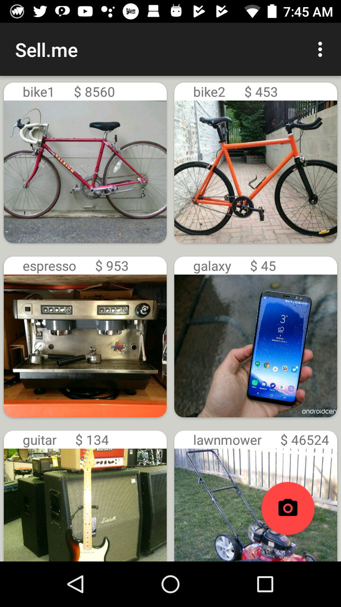

# Sell.me

A simple buy/sell clone. Implements a scrollable view that displays information about each item. Clicking on an item in the scrollable view opens up another screen showing information about the selected item. The bottom-right camera button allows the user to take a picture, add details, and post an item for sale on the app. The top-right menu shows a list of categories that can be used to filter results shown. 

# User Interface

